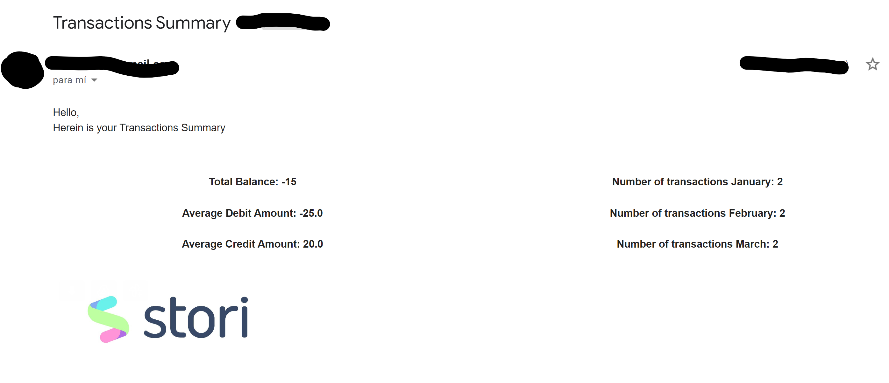

# Pythonic Email Delivery

## The Jupyter Notebook comprises code snippets and a comprehensive explanation concerning the development of this code.

## [Transactions](trxn.csv) is a handmande file with fictional transactions.

## This code means to send an email of the following fashion. Of course, some tweeking will make it look better.

## Resources:

### Learn the different ways to send emails through ['s tutorial on Joska de Langen's tutorial on The Real Python](https://realpython.com/python-send-email/#sending-fancy-emails)

### For attaching images inside the corpus with html, go to [Andrew Hare's](https://stackoverflow.com/users/34211/andrew-hare) [Stack Overflow answer for this inquery](https://stackoverflow.com/questions/920910/sending-multipart-html-emails-which-contain-embedded-images?newreg=543b5e7c7f3e4020a4c779205bdcda6c)

