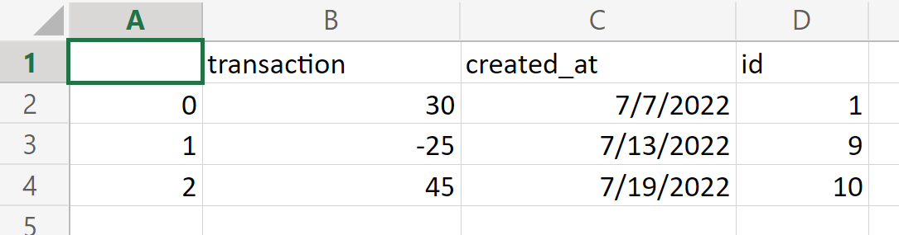

# Pythonic Email Delivery - Mock Financial System App

## The Jupyter Notebook comprises code snippets and a comprehensive explanation concerning the development of a simple Mock Financial System. 

## On a high level, this app is able host three purposes:

### * Create, store, edit and delete users
### * Automatically create and display a financial summary for each User
### * Send an email to a given user's email containing their summary and a .CSV file comprising their transactions

## The app is based on Flask and the database is hosted with SQLite and managed with SQLAlchemy.

## >0 transactions are considered credit, <0 transactions are considered debit; therefore, total = credit - debit

## This code means to send an email of the following fashion. Of course, some tweeking will make it look better.


## The transactions file will be generated on the spot and will be deleted once the email is sent. It will be presented in the following fashion: 


## All code is in the [jupyter notebook](Pythonic Email Sender - Mock Financial System App.ipynb)

## to run the app, in terminal run ````python email_sender_app.py```

## don't forget to set your virtual env to [environment.yml](environment.yml)


## Resources:

### Learn the different ways to send emails with python through [Joska de Langen's tutorial on The Real Python](https://realpython.com/python-send-email/#sending-fancy-emails) and [Mokhtar Ebrahim's tutorial on Like Geeks](https://likegeeks.com/python-send-emails/). 
### For further options on how to send emails with python, check [this article by Milan Bhardwaj for Courier](https://www.courier.com/blog/three-ways-to-send-emails-using-python-with-code-tutorials/)

### For attaching images inside the email corpus with html, go to [Andrew Hare's](https://stackoverflow.com/users/34211/andrew-hare) [Stack Overflow answer for this inquery](https://stackoverflow.com/questions/920910/sending-multipart-html-emails-which-contain-embedded-images?newreg=543b5e7c7f3e4020a4c779205bdcda6c). 

### Some refernces to running background [backend] tasks, check these [Stack Overflow answers for this inquery](https://stackoverflow.com/questions/42601478/flask-calling-python-function-on-button-onclick-event) and this [article by John Au-Yeung in The Web Dev](https://thewebdev.info/2022/04/02/how-to-call-a-python-flask-function-on-button-click-event/)

### To learn about how to develop an app with Flask and how to manage Databases with SQLAlchemy, definitely don't hesitate to check out [John Endler's tutorials to build a blog with Flask](https://youtube.com/playlist?list=PLCC34OHNcOtolz2Vd9ZSeSXWc8Bq23yEz)  

### To learn more about how to handle ORM SQLAlchemy, check out [Doug Farrel's article for The Real Python](https://realpython.com/python-sqlite-sqlalchemy/)

### [Wanna run HTML in Jupyter Notebook?](https://www.youtube.com/watch?v=rMrWMbfaOt4)

# Happy coding :)

